# Nzila OS — Repository Assessment

**Assessment Date:** 2026-03-10  
**Repository:** nzila-automation  
**Version:** Monorepo (pnpm workspaces)

---

## 1. Executive Summary

**Nzila OS** is a sophisticated internal platform backbone for Nzila Digital Ventures. It is a **polyglot monorepo** (TypeScript + Python/Django) comprising **16 applications** and **120+ shared packages**. The platform emphasizes **evidence-first governance**, **contract-enforced invariants**, and **org-scoped multi-tenancy**.

### Key Metrics

| Metric | Value |
|--------|-------|
| Apps | 16 |
| Packages | 120+ |
| Tests | 7,669+ passing |
| CI/CD Workflows | 20+ |
| Stack | Next.js + Django, TypeScript (strict), PostgreSQL 15, Redis 7 |

---

## 2. Architecture Overview

### 2.1 High-Level Architecture

```mermaid
graph TB
    subgraph "16 Apps"
        A1[web]
        A2[console]
        A3[partners]
        A4[union-eyes]
        A5[abr]
        A6[nacp-exams]
        A7[cora]
        A8[shop-quoter]
        A9[cfo]
        A10[trade]
        A11[pondu]
        A12[zonga]
        A13[mobility]
        A14[mobility-client-portal]
        A15[orchestrator-api]
        A16[platform-admin]
    end
    
    subgraph "Platform Packages"
        P1[platform-ontology]
        P2[platform-reasoning-engine]
        P3[platform-governed-ai]
        P4[platform-entity-graph]
        P5[platform-knowledge-registry]
        P6[platform-event-fabric]
        P7[os-core]
        P8[ai-sdk]
        P9[ml-sdk]
        P10[db]
    end
    
    subgraph "Infrastructure"
        I1[PostgreSQL 15]
        I2[Redis 7]
        I3[Azure Blob Storage]
        I4[BullMQ]
    end
    
    A1 --> P7
    A2 --> P7
    A3 --> P7
    P1 --> P2
    P2 --> P3
    P7 --> I1
    P7 --> I2
    P7 --> I3
```

### 2.2 Business Domains

| Domain | Apps | Purpose |
|--------|------|---------|
| **Agriculture** | Pondu, Cora | Smallholder supply chains, harvest tracking, warehouse ops |
| **Commerce** | Shop Quoter | Multi-vertical quoting engine, order lifecycle |
| **Trade** | Trade | Cross-border trade management, vehicle commerce |
| **Finance** | CFO | Stripe payments, QuickBooks sync, tax calendar, FX |
| **Union Management** | Union-Eyes | Grievance lifecycle, collective bargaining, elections |
| **Compliance & Exams** | NACP Exams | Examination administration, integrity proofs |
| **Operations** | Console | Governance, finance oversight, ML/AI management |
| **Mobility** | Mobility, Mobility-Client-Portal | Case management, family services, compliance |
| **Public** | Web | Marketing site, resource library |
| **Partners** | Partners | Entitlement-gated partner portal |

---

## 3. Platform Core Packages

### 3.1 Platform Ontology (`platform-ontology`)

Defines the canonical business entity type system with **40+ entity types**:

- **People**: Tenant, Organization, Person, User, Advisor, Member, Client, Family, Farmer
- **Cases & Claims**: Case, Claim, Program
- **Documents & Communications**: Document, Communication
- **Workflows**: Task, Workflow, Decision, Approval
- **Risk & Policy**: RiskEvent, Policy
- **Evidence & Audit**: EvidencePack, AuditEvent
- **Assets & Commerce**: Asset, Property, Deal, Invoice, Payment, Shipment, Product
- **Agriculture**: Parcel, Subsidy, RegistryRecord

### 3.2 Platform Reasoning Engine (`platform-reasoning-engine`)

Cross-vertical reasoning framework with:

- **Reasoning Chains**: Structured execution with steps, conclusions, citations
- **Confidence Scoring**: Weighted confidence aggregation
- **Reasoning Types**: deductive, inductive, abductive, analogical, causal, risk_based, policy_based, cross_vertical

### 3.3 Governed AI (`platform-governed-ai`)

AI operations with full governance lifecycle:

1. **Policy Pre-check** — Tenant/regulatory policy evaluation
2. **Model Invocation** — Structured AI model calls
3. **Evidence Grounding** — Attach evidence chain
4. **Audit Persistence** — Full AI run recording

### 3.4 New Platform Packages (Visible in Environment)

The following platform packages were observed in the environment and represent the next-generation platform capabilities:

- `platform-admin` — Administrative console for platform governance
- `platform-observability` — Platform-wide observability hooks
- `platform-context-orchestrator` — Cross-vertical context management
- `platform-entity-graph` — Entity relationship graph
- `platform-knowledge-registry` — Knowledge management
- `platform-event-fabric` — Event streaming
- `platform-data-fabric` — Data integration
- `platform-decision-graph` — Decision graph
- `mobility-case-engine` — Mobility case management
- `mobility-compliance` — Mobility compliance
- `mobility-family` — Family services
- `mobility-programs` — Program management

---

## 4. Governance & Invariants

### 4.1 Contract Enforcement (5,000+ Tests)

| Invariant | Enforcement |
|-----------|-------------|
| **Org-scoped everything** | All data queries, mutations, API routes scoped to `orgId` |
| **Evidence-first** | Hash-chained audit trails with Azure Blob storage |
| **Content boundary** | Apps read from `content/` — NEVER from `governance/` |
| **SDK-only AI/ML** | Apps consume `@nzila/ai-sdk` and `@nzila/ml-sdk` |
| **Auth on all routes** | Every API route calls `authorize()` |
| **Stack authority** | Django-authoritative apps must not mutate via Drizzle |

### 4.2 Stack Authority

- **Django-authoritative apps**: Union-Eyes, ABR — must not mutate domain data via Drizzle
- **TS-authoritative apps**: Must not introduce a Django backend
- Enforced by `tooling/contract-tests/stack-authority.test.ts`

---

## 5. CI/CD & Security

### 5.1 GitHub Workflows (20+)

| Workflow | Purpose |
|----------|---------|
| `ci.yml` | Primary CI gate |
| `control-tests.yml` | Scheduled control validation |
| `codeql.yml` | Static analysis |
| `dependency-audit.yml` | CVE scanning |
| `secret-scan.yml` | Secret leak detection |
| `sbom.yml` | Software Bill of Materials |
| `trivy.yml` | Container vulnerability scanning |
| `compliance.yml` | Compliance validation |
| `ai-governance.yml` | AI governance |
| `nzila-governance.yml` | Platform governance |
| `release-train.yml` | Release evidence + SBOM generation |
| `game-day.yml` | Chaos engineering |
| `red-team.yml` | Red team operations |

### 5.2 Security Features

- **Secrets management**: Azure Key Vault integration
- **Secret scanning**: `.gitleaks.toml` configured
- **Security headers**: `tooling/security-headers-check.ts`
- **Environment validation**: Zod-based env validation at startup
- **Tenant isolation**: Org-scoped RLS (Row-Level Security)

---

## 6. Quality Attributes

### 6.1 Testing

- **7,669+ tests** passing
- Contract tests enforce invariants
- Integration tests for commerce domain
- AI evaluation harness in `tooling/ai-evals/`

### 6.2 Observability

- **Structured logging**: Platform-wide correlation IDs
- **Request tracking**: `requestId` (UUID) and `traceId` on every API request
- **OpenTelemetry**: Metrics collection
- **Audit events**: All events reference correlation IDs

### 6.3 Configuration Management

- **Fail-fast**: Invalid env causes process exit before serving traffic
- **Zod validation**: Environment variables validated at startup
- **Environment examples**: `.env.example` provided

---

## 7. Technology Stack

### 7.1 Frontend

- **Next.js** (App Router)
- **TypeScript** (strict mode)
- **Tailwind CSS** (v4)
- **React** (Server Components)

### 7.2 Backend

- **Django** (legacy/authoritative apps)
- **Node.js** (Fastify for orchestrator-api)
- **PostgreSQL 15** (with RLS)
- **Redis 7** (BullMQ for queues)

### 7.3 Infrastructure

- **Azure Blob Storage** (evidence/immutable storage)
- **Azure Key Vault** (secrets)
- **pnpm** (workspace management)

---

## 8. Assessment Summary

### Strengths

1. **Comprehensive governance model** — Evidence-first with hash-chained audit trails
2. **Strong invariant enforcement** — 5,000+ contract tests
3. **Well-structured monorepo** — Clear separation between apps, packages, and tooling
4. **Extensive CI/CD** — 20+ workflows covering security, compliance, and deployment
5. **Modern platform capabilities** — Ontology, reasoning engine, governed AI
6. **Multi-tenant architecture** — Org-scoped RLS throughout

### Areas of Attention

1. **Complexity** — 120+ packages can create maintenance overhead
2. **Stack authority** — Django + TS dual-authority requires careful coordination
3. **New platform packages** — Platform packages are still evolving (observed `platform-*` in development)
4. **Documentation drift** — Large codebase requires up-to-date architecture docs
5. **Test maintenance** — 7,669+ tests require ongoing maintenance

---

## 9. Recommendations

### For Platform Team

1. **Consolidate platform packages** — Establish clear ownership for the 30+ `platform-*` packages
2. **Document platform boundaries** — Clarify when to use new platform packages vs. existing `@nzila/*` packages
3. **API surface management** — Ensure platform packages maintain stable APIs

### For Development Teams

1. **Adhere to stack authority** — Continue enforcing Django vs. TypeScript boundaries
2. **Use SDKs exclusively** — Never bypass `@nzila/ai-sdk` or `@nzila/ml-sdk`
3. **Maintain invariant tests** — Continue growing contract test coverage

### For Operations

1. **Monitor bundle sizes** — Large monorepo can lead to deployment bloat
2. **Optimize CI** — 20+ workflows need efficient caching strategies
3. **Incident response readiness** — Ensure runbooks cover new platform components
