# Nzila OS — Repository Assessment

## Executive Summary

Nzila OS is a sophisticated, enterprise-grade monorepo serving as the internal control backbone for the Nzila platform. It implements a comprehensive governance-first architecture with evidence generation, RBAC, telemetry, and compliance controls across multiple verticals (agriculture, trade, finance, healthcare exams).

| Attribute | Assessment |
|-----------|------------|
| **Type** | TypeScript/Node.js Monorepo (Turborepo) |
| **Package Manager** | pnpm 10.11.0 |
| **Scale** | 13 apps, 80+ packages |
| **Maturity** | Enterprise-ready with extensive governance |
| **Security Posture** | Strong - secrets scanning, SBOM, build attestation |
| **Compliance** | Hash-chained evidence, policy engine, audit trails |

---

## Architecture Overview

```mermaid
graph TB
    subgraph "Apps Layer"
        A[console<br/>ops console]
        B[partners<br/>partner portal]
        C[union-eyes<br/>case mgmt]
        D[abr<br/>AI/ML governance]
        E[pondu<br/>agri operations]
        F[cora<br/>agri intelligence]
        G[trade<br/>trade operations]
        H[web<br/>marketing]
        I[cfo<br/>finance ops]
        J[zonga<br/>vertical app]
        K[nacp-exams<br/>healthcare exams]
        L[shop-quoter<br/>e-commerce]
        M[orchestrator-api<br/>API orchestration]
    end
    
    subgraph "Platform Packages"
        P1[platform-evidence-pack]
        P2[platform-policy-engine]
        P3[platform-observability]
        P4[platform-compliance-snapshots]
        P5[platform-isolation]
    end
    
    subgraph "Domain Packages"
        D1[agri-core]
        D2[commerce-governance]
        D3[trade-core]
        D4[ai-core]
        D5[ml-core]
    end
    
    A --> P1
    B --> P2
    C --> P3
    D --> P4
    E --> D1
    F --> D1
    G --> D3
    D --> P5
```



---

## Key Strengths

### 1. Evidence-First Architecture
- All material actions produce tamper-evident audit trails
- Azure Blob Storage with hash chaining
- Evidence packs are reproducible and hash-verified
- Full forensic artifact linkage for incident response

### 2. Comprehensive Contract Testing
- **147 contract test files (~1,655 test cases)** enforcing architectural invariants, plus 3 red-team files (63 adversarial cases)
- Tests cover: org isolation, stack authority, evidence mandatory, audit immutability, API contracts, rate limiting
- Pre-commit guardrails with lefthook (gitleaks, ESLint, TypeScript)
- Hash chain drift detection

### 3. Enterprise-Grade Security
- Secret scanning with custom `.gitleaks.toml` (Clerk, Stripe, Azure Key Vault, QBO, webhook secret, database URL patterns — 6 custom rules)
- CycloneDX SBOM generation
- ed25519 build attestation
- Vulnerability scanning (Trivy, dependency audit)
- Security headers validation

### 4. Strict Governance Model
- AI governance with model cards and evaluation harness
- Business and corporate governance frameworks
- Security governance with threat models
- Policy engine with SLO, cost, dependency, integration policies

### 5. Operational Excellence
- Disaster recovery (RTO: 4 hours, RPO: 1 hour)
- Incident response with severity levels (SEV-1: 15min response)
- Verification commands: `verify:env`, `generate:sbom`, `validate:pack`, `reproduce:evidence`, `verify:security`, `health:report`

---

## Repository Structure

### Apps (13)
| App | Purpose |
|-----|---------|
| `console` | Internal ops console (governance, finance, ML, AI) |
| `partners` | Partner portal (entitlement-gated) |
| `web` | Public marketing/landing |
| `union-eyes` | UE case management |
| `pondu` | Agri field operations (producers, harvests, lots, quality, warehouse, shipments, payments) |
| `cora` | Agri intelligence dashboard (yield, pricing, risk, traceability) |
| `abr` | AI/ML governance & insights |
| `trade` | Trade operations |
| `cfo` | Finance operations |
| `zonga` | Additional vertical |
| `nacp-exams` | Healthcare exams |
| `shop-quoter` | E-commerce |
| `orchestrator-api` | API orchestration |

### Platform Packages (Key)
- `platform-evidence-pack` — Evidence generation & retention
- `platform-policy-engine` — Policy evaluation & enforcement
- `platform-observability` — Structured logging, metrics, health checks
- `platform-compliance-snapshots` — Compliance snapshot generation
- `platform-isolation` — Multi-org isolation enforcement
- `platform-performance` — Performance metrics & scale harness
- `platform-cost` — Budget tracking & cost events

### Domain Packages
- `agri-core`, `agri-db`, `agri-events`, `agri-intelligence`, `agri-traceability`
- `commerce-governance`, `commerce-audit`, `commerce-events`
- `trade-core`, `trade-cars`, `trade-adapters`
- `ai-core`, `ai-sdk`, `ml-core`, `ml-sdk`
- `qbo`, `payments-stripe`, `tax`

---

## CI/CD Pipeline

The CI pipeline (`.github/workflows/ci.yml`) enforces:

1. Lint & TypeScript checks
2. Unit tests
3. **Build all** (Turborepo full build)
4. **Contract tests** (architectural invariants)
5. AI evaluation gate
6. ML tooling gates
7. Schema drift detection
8. **Red-team adversarial tests**
9. Hash chain drift detection
10. **Enterprise hardening gate**
11. Ops pack validation

---

## Risk Considerations

| Area | Status | Notes |
|------|--------|-------|
| **Complexity** | ⚠️ High | 80+ packages requires careful dependency management |
| **Multi-stack** | ⚠️ Mixed | Django-authoritative (UE, ABR) + TS/Drizzle apps; requires strict stack authority enforcement |
| **Contract Test Maintenance** | ⚠️ Effort | 147 test files (~1,655 cases) need ongoing maintenance as architecture evolves |
| **Evidence Reproducibility** | ✅ Strong | Full hash chain verification implemented |
| **Org Isolation** | ✅ Strong | Runtime and compile-time isolation enforced |

---

## Recommendations

1. **Continue investing in contract tests** — The 147 test files (~1,655 cases) are a significant asset for maintaining architectural integrity
2. **Monitor build times** — With 80+ packages, build performance should be tracked
3. **Document stack authority boundaries** — Critical for new team members understanding Django vs TS boundaries
4. **Maintain evidence reproducibility** — This is a key enterprise selling point
5. **Expand red-team testing** — Already implemented, but could cover more attack vectors

---

## Verification Commands

```bash
pnpm verify:env          # Validate Node, pnpm, lockfile, env vars
pnpm generate:sbom       # Generate CycloneDX SBOM
pnpm validate:pack       # Validate procurement pack completeness
pnpm reproduce:evidence  # Verify evidence reproducibility
pnpm verify:security    # Check security headers
pnpm verify:backup      # Verify backup integrity
pnpm health:report       # Generate platform health report
pnpm contract-tests      # Run architectural invariant tests
pnpm demo:golden         # Run golden-path demo
```

---

*Assessment generated: 2026-03-05*

---

# Union-Eyes — Application Assessment

> Detailed evaluation of the Union-Eyes case management application

---

## Overview

| Attribute | Assessment |
|-----------|------------|
| **Framework** | Next.js 16.1.6 + React 19 |
| **Language** | TypeScript |
| **Purpose** | Union case management (grievances, discipline, claims) |
| **Database** | PostgreSQL with Drizzle ORM |
| **Auth** | Clerk |
| **Evidence** | Hash-chained evidence packs with Azure Blob |
| **Test Coverage** | 8 test files (unit + integration), 2 E2E specs |
| **Contract Tests** | 9 UE-specific invariants |

---

## Architecture

### Layer Structure

```
┌─────────────────────────────────────────────┐
│  app/           (Pages, Layouts, RSC)       │
├─────────────────────────────────────────────┤
│  components/    (UI components)             │
├─────────────────────────────────────────────┤
│  actions/       (Server Actions)            │
├─────────────────────────────────────────────┤
│  services/      (Business logic)            │
├─────────────────────────────────────────────┤
│  lib/           (Utilities, validation)    │
├─────────────────────────────────────────────┤
│  db/            (Drizzle ORM, schemas)       │
├─────────────────────────────────────────────┤
│  infra/         (Azure, AWS, Firebase)      │
└─────────────────────────────────────────────┘
```

### Boundary Contracts (INV-40, INV-41)

The app enforces strict layer boundaries via contract tests:

| Layer | Cannot Import From |
|-------|---------------------|
| `components/` | `db/`, `infra/`, `services/` |
| `app/` (pages) | `db/`, `infra/` (except API/admin) |
| `db/` | `actions/`, `services/`, `app/`, `components/` |
| `services/` | `app/`, `components/` |
| `actions/` | `app/`, `components/` |

---

## Current Test Coverage

### Unit & Integration Tests (8 files)

| File | Location | Purpose |
|------|----------|---------|
| `action-dtos.test.ts` | `lib/__tests__/` | DTO schema validation |
| `action-flows.integration.test.ts` | `lib/__tests__/` | End-to-end action flow contracts |
| `error-codes.test.ts` | `lib/__tests__/` | Error code stability |
| `logger.test.ts` | `lib/__tests__/` | Structured logging |
| `seed-cape-acep.test.ts` | `lib/__tests__/` | Pilot seed verification |
| `validation.test.ts` | `lib/__tests__/` | Zod schema validation |
| `workflows.test.ts` | `services/financial-service/src/tests/` | Financial workflow logic |
| `analytics.test.ts` | `services/financial-service/src/tests/` | Financial analytics logic |

> **Note:** `vitest.config.ts` excludes `services/**`, so the 2 tests in `services/financial-service/` are not executed by the runner.

### E2E Tests (2 files)

| File | Purpose |
|------|---------|
| `smoke.spec.ts` | Public page rendering, accessibility smoke |
| `dashboard.spec.ts` | Dashboard authenticated flows |

### Contract Tests (UE-specific)

- `ue-no-raw-db.test.ts` — App-layer can't use raw DB without RLS
- `ue-org-scoped-registry.test.ts` — Org-scoped table registry consistency
- `ue-rls-org-context.test.ts` — RLS org context enforcement
- `ue-role-graph.test.ts` — RBAC role graph validation
- `ue-audited-mutations.test.ts` — Auditing on mutations
- `ue-evidence-adoption.test.ts` — Evidence adoption coverage
- `ue-evidence-seal.test.ts` — Evidence seal enforcement
- `ue-component-boundary.test.ts` — Component → db/infra/services boundary
- `ue-layer-boundary.test.ts` — Layer architectural boundaries

---

## Key Features

### Evidence System

- **Evidence Export UI** — Admin can export sealed evidence packs (JSON/CSV/PDF)
- **Tamper-proof seals** — Watermarked, audit-logged exports
- **Hash-chained** — Integration with platform-evidence-pack

### Error Handling

- **Stable Error Codes** — 28 error codes following `DOMAIN_VERB_REASON` convention
- **Action Error Factory** — `actionError()` helper for consistent error responses
- **Categories**: Auth, Validation, Claims, Organizations, Members, Credits, Analytics, Admin, Export, Infrastructure

### Validation

- **Zod-based** — All inputs validated via Zod schemas
- **Action DTOs** — Type-safe DTOs in `types/action-dtos.ts`
- **Validation Library** — Centralized in `lib/validation.ts`

---

## Baseline Audit Results (from WORLD_CLASS_PLAN.md)

| Check | Status | Notes |
|-------|--------|-------|
| Lint | ✅ PASS | 0 errors, 0 warnings |
| Typecheck | ✅ PASS | 0 errors (but excludes ~200+ files via tsconfig) |
| Tests | ⚠️ NEEDS WORK | 8 test files exist but `vitest.config.ts` excludes `services/**` — only 6 of 8 run; E2E not in CI |
| Console | ⚠️ NEEDS WORK | Runtime `console.*` in `middleware.ts`, `lib/api.ts`, `lib/api/index.ts`, `lib/logger.ts`; deliberate wrapper in `lib/console-wrapper.ts` |
| `any` Usage | ⚠️ ~155 instances | ~42 in actions/, ~113 in services/ (combined with `noImplicitAny: false`) |

### Technical Debt

- **Type exclusions** — `tsconfig.json` excludes `services/**`, `backend/**`, `infra/**`, `db/schema/**`, `db/migrations/**`, `db/queries/**`, plus many `lib/*` paths
- **noImplicitAny: false** — Hides ~200+ TypeScript errors
- **Vitest excludes `services/**`** — 2 test files in `services/financial-service/src/tests/` are silently skipped
- **Tenant residue** — 175 files still contain "tenant" references (56 in runtime app code, 54 in services, 50 in DB, 12 in backend) despite ongoing tenant→org migration
- **Runtime `console.*`** — Raw `console.*` calls in middleware.ts, lib/api.ts, lib/api/index.ts, lib/logger.ts (should use structured logger)
- **`as any` / `null as any`** — `actions/admin-actions.ts` lines 22-26 contain `organizations as any`, `null as any` stubs

---

## Hardening Roadmap (WORLD_CLASS_PLAN)

### Phase 1 — Type Purity
- Fix `any` in actions (~42 instances) and services (~113 instances)
- Add Zod schemas for all action inputs
- Move ts-errors-*.txt to plans/tech-debt/

### Phase 2 — Architecture Contracts
- UE component boundary contract (already implemented)
- UE layer boundary contract (already implemented)

### Phase 3 — Test Stack
- Unit tests for actions + services (≥10 test cases)
- Integration tests for server actions
- Playwright E2E setup
- Remove `--passWithNoTests`

### Phase 4 — A11y + Perf + Error UX
- jsx-a11y lint plugin
- Error boundaries + stable error codes
- Bundle budget config

### Phase 5 — CAPE-ACEP Pilot
- Seed script verification (< 5 min)
- Evidence export in UI (✅ Implemented)

---

## Dependencies (Key)

### Core
- Next.js 16.1.6, React 19.2.4
- Drizzle ORM 0.45.1
- Clerk (auth)
- Zod 3.23.8

### Cloud
- Azure (Blob, Key Vault, Identity, Cognitiveservices)
- AWS (S3, Textract)
- Firebase Admin
- Google Cloud Vision

### Integrations
- Stripe, Square, Twilio
- Microsoft Graph
- Resend (email)
- Tesseract.js, PDFKit (document processing)
- TensorFlow.js (ML)

### Observability
- Sentry
- OpenTelemetry

---

## Risk Assessment

| Area | Risk Level | Mitigation |
|------|------------|------------|
| Type Safety | Medium | Phased removal of `any`, expand type coverage |
| Test Coverage | Medium | Add unit + integration tests in Phase 3 |
| Complexity | High | 170+ dependencies, multiple cloud providers |
| Boundary Violations | Low | Contract tests enforce boundaries |
| Evidence Integrity | Low | Hash-chained, seal-verified |

---

## Recommendations

1. **Expand test coverage** — Add real unit tests for actions/services (Phase 3)
2. **Type strictness** — Gradually remove `any` and `tsconfig` exclusions
3. **A11y compliance** — Add jsx-a11y plugin to ESLint
4. **Bundle analysis** — Set up webpack bundle analysis in CI
5. **Continue pilot hardening** — Evidence export is already implemented, focus on seed verification

---

## Final Gate Checklist

- [ ] `pnpm -C apps/union-eyes lint` — PASS
- [ ] `pnpm -C apps/union-eyes typecheck` — PASS (0 errors)
- [ ] `pnpm -C apps/union-eyes test` — PASS (real tests, no `--passWithNoTests`)
- [ ] `pnpm -C apps/union-eyes e2e` — PASS (Playwright headless)
- [ ] `pnpm contract-tests` — PASS (repo-wide, including UE contracts)
